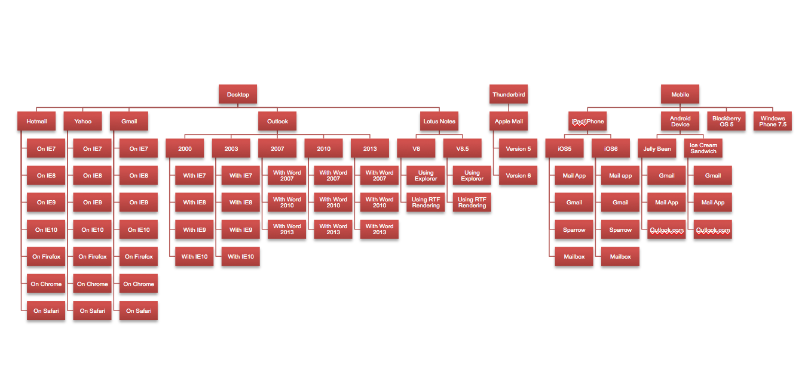
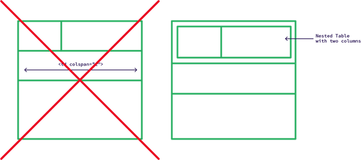

## Phần 1 - Những gì bạn cần biết về HTML Email

Email là một công cụ dùng để marketing khá là tuyệt vời. Theo một báo cáo nào đó thì mức ROI (lợi nhuận đầu tư) của công cụ này đạt đến 4000%. Tuy nhiên, mọi người vẫn còn đánh giá thấp nó, và thực hiện nó chưa được tốt cho lắm. Với sự bùng nổ của smartphones, chúng ta ngày càng thường xuyên đọc mail bằng iPhone hay Galaxy, nhưng thực tế là hầu như rất nhiều các emai marketing đều bị fail, và không đến được khách hàng. Đây quả thực là một thiếu sót lớn và rất là đáng tiếc. Bởi vì nếu email chúng ta được làm một cách tốt hơn thì hiệu quả mà nó mang lại sẽ rất lớn. 

### Coding HTML Email có thể là một thử thách gây đau đầu =]
Nếu bạn đã từng thử thiết kế một HTML email, chắc hẳn, bạn sẽ thấy rằng công việc này thật sự khá là khó. Và nếu bạn vẫn chưa hình dung được nó là thế nào. Thì mình cũng sẽ xác nhận luôn là nó khó vcl :)). Đây là một số nguyên nhân:

#### Email không hề có một tiêu chuẩn nào cả
> Chúng ta sẽ tiếp tục sử dụng Word cho việt tạo tin nhắn email, bởi vì chúng ta tin rằng nó là mang lại trải nghiệm viết mail tốt nhất.

The Outlook Team
Khi code một trang web, ít nhất bạn cũng có thể tin chắc một điều là, tất cả các trình duyệt web chính (Chrome, Firefox, IE, Safari và Opera) đều cố gắng tuân theo một tiêu chuẩn trong việc render HTML và CSS.
Đến khi đụng đến các email client, bạn lại phải test nó trên một đống các chương trình từ thời napolenon cho đến bây giờ =]. Nó trải dài từ các dòng điện thoại mới chạy trên Android hay iOS cho đến cái Lotus Notes của IBM hay Microsoft Office 2007 (Cái thứ mà sẽ render cái file HTML xênh đẹp của bạn bằng thứ gọi là Word HTML rendering engine. Trong khi các phiên bản Outlook trước thì họ lại dùng một browser để render - điều mà có vẻ logic hơn nhiều. Bạn chắc sẽ hỏi: "tại sao họ lại chuyển qua xài cái engine củ cải này?" Và câu trả lời của họ là: "Vì nó an toàn hơn"). Và không có bất kỳ cái chương trình nào trong đống trên phải tuân theo một nguyên tắc chung nào về web cả. Họ chỉ tự tạo theo ý họ mà thôi. Bạn có thể tìm thêm về cái tiêu chuẩn hỗ trợ của những cái email client này tại [đây](https://www.email-standards.org/).

Nếu nó vẫn chưa đủ tệ, thì bạn chắc chắn sẽ sml với cái fact tiếp theo sau đây: Có khoảng hàng triệu cách kết hợp khác nhau để một cái email có thể render trên desktop hay là mobile.


Đây là một danh sách khác email client phổ biến:

**Mobile clients:**
- Android 2.3 & 4.0
- iPhone 5  iOS 6
- iPhone 4S  iOS 6
- iPhone 3GS  iOS 5
- iPad 2  iOS 6
- BlackBerry OS 4 & 5
- Symbian S60
- Windows Phone 7.5

**Desktop clients:**
- Apple Mail 4, 5, 6
- Lotus Notes 8.5
- Lotus Notes 8
- Thunderbird
- Windows Live Mail
- Outlook 2013
- Outlook 2011 for Mac
- Outlook 2010
- Outlook 2007
- Outlook 2003
- Outlook 2002/XP
- Outlook 2000

**Webmail clients:**
- AOL Mail (on any browser)
- Gmail (on any browser)
- Outlook.com (on any browser)
- Yahoo! (on any browser)

Nhìn hoa cả mắt @@

> Nếu bạn đã quen thuộc với việc phát triển web, hãy quên tất cả mọi thứ về nó đi.

Để HTML Email của bạn có thể hiển thị đúng với tất cả các thiết bị trên thì có một vài cách. Bạn có thể sử dụng mấy cái như conditional comment, nhưng mà nó sẽ bị giới hạn với một vài phiên bản Outlook nhất định, hoặc là tất cả client khác trừ một vài phiên bản Outlook :v.

Nếu bạn đã quen thuộc với việc phát triển web, thì tốt nhất là bạn nên quên hết đi. Vì cái rào chắn lớn nhất của bạn khi làm về HTML Email chính là bản thân bạn =]. Bạn sẽ luôn nghĩ là mọi thứ sẽ y chang như cách phát triển web mà bạn hay làm và nát =] . Bạn có thể trở nên giận dữ chỉ vì cái thẻ Div hoặc là cái thuộc tính margin không thể hiện như bình thường. Vì vậy, hãy quên đi mọi thứ mà bạn biết về HTML thông thường cũng như CSS mới nhất. Tin tôi đi, nó sẽ giúp bạn rất nhiều =].

### Cách tiếp cận vấn đề
Trước hết, hãy nhìn sơ qua một vài gợi ý về email-building workflow.

#### Làm việc với cấu trúc đầu tiên
Việc xây dựng một cấu trúc của email đầu tiên có thể giúp bạn giảm tránh các nguy cơ bugs hay lỗi trong các giai đoạn sau. Đừng bao giờ đâm đầu vào làm hết rồi test - bạn sẽ thường xuyên kết thúc dự án bằng một chồng bug.

#### Kiểm tra thường xuyên
Làm đến khi nào bạn đến một mốc nhỏ nào đó (ví dụ, khi bạn hoàn thành cấu trúc cơ bản) rồi kiểm tra thử. Cách tốt nhất để kiểm tra chính là sử dụng [Litmus](https://litmus.com/) hay [Email on Acid](https://www.emailonacid.com/). Mình khuyên các bạn nên dùng các gói unlimited của các công ty trên vì bạn sẽ phải test rất thường xuyên.

Một cách để test nữa là bạn có thể sử dụng thuộc tính border của table để có thể nhìn được bạn đang tạo cái gì =], sau khi hoàn thành thì bạn hãy tắt các thuộc tính đó đi. Bạn cũng có thể cân nhắc việc sử dụng background-color với các ô trong bảng để giúp bạn xác định các vùng. Ý tưởng qui trình của mình là tạo một cái sườn, kiểm tra, bỏ content vô, kiểm tra, style colors và fonts, kiểm tra thêm lần nữa và cuối cùng là remove hết các borders và kiểm tra lần cuối trước khi gửi mail.

#### Validate thường xuyên
Bạn nên validate HTML Email thường xuyên nhất có thể bằng công cụ [W3C Validator](http://validator.w3.org/). Điều này sẽ giúp bạn soi ra một vài chi tiết nhỏ nhặt như thiếu đóng mở tag.

#### Gửi Emai của bạn
Có hàng tá lựa chọn để gửi email. Có hai dịch vụ mà mình dùng nhiều nhất là [MailChimp](https://mailchimp.com/) và [Campaign Monitor](https://www.campaignmonitor.com/). Các dịch vụ này giá cả khá cạnh tranh và rất dễ sử dụng.

#### Nội dung, Lập trình và Spam scores
Khi nói đến SPAM; nội dung, thiết kế, và lập trình sẽ luôn đi chung với nhau. Có một vài chiến thuật spam điển hình mà ta cần tránh, ví dụ như viết hoa hết và sử dụng nhiều dấu chấm than trong phần subject. Có một vài từ sẽ có thể kích hoạt bộ lọc spam như "Free" "Đầu tư". Code của bạn càng sạch thì email bạn càng ít khả năng bị đánh dấu là spam. Tỉ lệ hình và chữ cũng là một yếu tố ảnh hưởng đến việc spam này. Email dựa quá nhiều vào hình ảnh mà không có chữ nào thì khả năng rất cao sẽ bay vào thùng SPAM, các email với tên hình dài cũng vậy.
Thuật ngữ SPAM scores khá là khó nhằn. Để chắc chắn rằng mail của chúng ta sẽ không bị rơi thằng vào thùng spam, bao nhiêu công sức đổ sông, đổ biển. Chúng ta nên kiểm tra SPAM bằng account test của mình qua 2 công cụ là [Litmus](https://litmus.com/) hay [Email on Acid](https://www.emailonacid.com/) trước khi gửi email.

### Bắt đầu lập trình

#### Công cụ
Bạn có thể sử dụng text editor mà bạn thích (mình sử dụng Sublime Text) và một công cụ để test, bạn có thể sử dụng của Litmus hay Email on Acid. 

#### Khái niệm căn bản
Chúng ta sẽ đi từ đầu. Các framework như [HTML Email Boilerplate](http://htmlemailboilerplate.com) có khá nhiều trick hay và các đoạn snippet mà bạn có kể implement một cách dễ dàng. Tuy nhiên, nếu bạn mới bắt đầu thì bạn không nên sử dụng nó ngay. Bởi vì nó chứa khá nhiều thứ không cần thiết cho bạn. Điều này có thể gây khó khăn thêm với bạn khi sửa một lỗi nào đó.

**Chú ý:** Bởi vì độ khó của viêc này, nhất là đối với việc sửa các lỗi. Bạn không nên sử dụng một cái editor nào đó mà quảng cáo rằng sẽ format design của bạn và bụp phát biến nó thành code HTML cho Email. Họ đang xạo đó =]

#### !DOCTYPE
Bạn cần phải có một template trắng để bắt đầu, và template đó cần phải có một Doctype. Doctype là một dòng code quan trọng, nó sẽ báo cho chương trình đang đọc file HTML rằng những HTML tag nào có thể dùng và các chuẩn HTML và CSS cần tuân theo. Sẽ có vài client không quan tâm đến cái dòng này, và một vài client sẽ áp dụng nó theo cách riêng nào đó.
Chúng ta nên sử dụng XHTML doctype bởi tính ổn định của nó. Mình sẽ sử dụng phiên bản XHTML-Transitional 1.0 vì độ ổn định của nó. Trong các hướng dẫn tiếp theo, mình sẽ luôn sử dụng đoạn code sau để bắt đầu xây dựng một template HTML email.
```
<!DOCTYPE html PUBLIC "-//W3C//DTD XHTML 1.0 Transitional//EN" "http://www.w3.org/TR/xhtml1/DTD/xhtml1-transitional.dtd">
<html xmlns="http://www.w3.org/1999/xhtml">
<head>
<meta http-equiv="Content-Type" content="text/html; charset=UTF-8" />
<title>Demystifying Email Design</title>
<meta name="viewport" content="width=device-width, initial-scale=1.0"/>
</head>
```
Meta tag `Content-Type` sẽ giúp engine render HTML xử lý các text cũng như ký tự đặc biệt. Trong thực tế, bạn cần phải mã hóa tất cả các ký tự đặc biệt (ví dụ như & sẽ thành $amp) để cho an toàn.

Meta tag `viewport` sẽ báo cho thiết bị là chúng ta muốn set chiều rộng của phần hiển thị bằng với chiều rộng của thiết bị. Nó cũng sẽ set độ scale thành normal, nó nghĩa là không cho phép phóng to hay thu nhỏ. Nếu bạn không khai báo những thứ này, có rất nhiều smartphone sẽ scale nội dung hiển thị của bạn xuống để vừa với phần hiển thị.Nó có thể dẫn tới việc các hình ảnh sẽ bị tràn ra ngoài màn hình.

Cuối cùng, bạn luôn luôn cần phải đặt một title có ý nghĩa vì nó sẽ hiển thị khi mà người xem đọc email trên browser, hoặc là share với bạn bè của họ.

#### Email là sự kết hợp của các bảng.
Do thiếu sự hỗ trợ trong các chuẩn về HTML CSS trong email, chúng ta sẽ không thể sử dụng các thẻ div, section hay là article. Thay vào đó chúng ta phải sử dụng table. Hơn thế nữa, bạn cần phải sử dụng rất nhiều các bảng lồng vào nhau, bởi vì các thuộc tính như `colspan` hay `rowspan` cũng không được hỗ trợ =]



#### Sử dụng các cell thay vì các thẻ văn bản
Một lần nữa, bởi vì sự thiếu hỗ trợ các chuẩn trong email, bạn không nên sử dụng các thẻ như `h1`, `h2`, `h3` hay là `p`. Những thẻ này sẽ không ổn định khi render giữa các email client và nó là vấn đề khá đau đầu.

Bạn thân nhất của bạn lúc này chính là các cell, các ô của các table. Bạn sẽ đặt các đoạn văn trong các ô này và áp dụng các kiểu inline-styling cho các ô đó. Ví dụ:
```
<tr>
 <td style=“font-size: 12px; font-family: Arial, sans-serif; color: #666666;”>
   Text
 </td>
</tr>
```

#### Sử dụng inline style hay là là stylesheets?
Đây có vẻ nghiên về sở thích cá nhân nhiều hơn. Cá nhân mình thì chọn bỏ tất cả các style trong một hàng (trong các thẻ) vì nó sẽ giúp mình biết chính xác được cái gì đang diễn ra. Bạn cũng có thể đặt tất cả các style ở dòng cuối. Nhưng nó sẽ gây khó khăn trong việc hiểu code cũng như khi sửa lỗi nào đó. 

**Đừng quên:** Bạn không thể áp dụng nhiều class cho một element trong HTML email. Nó không hỗ trợ việc này, mỗi element chỉ có thể có tối đa 1 class.

**Cũng đừng quên:** Bạn không thể  định nghĩa style kiểu shorthand cho các thuộc tính (ví dụ: style="font: 8px/14px Arial, sans-serif;") Bởi vì nó cũng không được hỗ trợ.

#### Tên hình và SPAM Scores
Khi save một bức hình lại, hãy luôn nhớ đặt cho nó một cái tên ngắn gọn và ý nghĩa nhất có thể. Nó sẽ giúp cải thiện spam score của bạn. Tên như là "campaign_054_design_0x0_v6_email-link.gif" sẽ có SPAM score cao hơn là "email.gif"

#### Kích cỡ hình ảnh
Bạn nên cố gắng giữ cho kích cỡ email nhỏ nhất có thể: dưới 100kb là một con số lý tưởng, nhưng không phải lúc nào cũng có thể đạt được, con số thông thường là dưới 250kb. Bạn có thể sử dụng các công cụ nén ảnh như JPEGmini hay là tiniPNG để giảm kích cỡ hình ảnh xuống hết mức có thể. Việc load mail chậm, đặc biệt là trên mobile có thể khiến email của bạn không thể hiển thị.

#### Các lời khuyên khác
Đừng nên quá dựa dẫm vào email client. Luôn phải khai báo thuộc tính như width. Luôn phải set kích thước của container chính chứa các element theo pixel. Bạn có thể sử dụng theo phần trăm thay vì pixel nếu thích.

### Kết luận
Có khá nhiều điều cần phải tìm hiểu khi thiết kế, phát triển một HTML email, hầu hết là các khái niệm theo một chuẩn mà bạn  chưa bao giờ được khuyên làm theo khi phát triển một trang web bình thường =]. Tuy nhiên, bài hướng dẫn này đã đưa ra một số kiến thức nền tảng để bắt đầu. Bây giờ, bạn có thể sẵn sàng bắt tay vào làm một cái HTML email thật sự.

#### Các link cần thiết

- [Litmus](https://litmus.com/) testing tools
- [Email on Acid](http://www.emailonacid.com/) testing tools
- [The Outlook Team Blog](http://blogs.office.com/b/microsoft-outlook/)
- [The Litmus Team Blog](https://litmus.com/blog/)
- [The Email Standards Project](http://www.email-standards.org/)
- [W3C Validator](http://validator.w3.org/)
- [MailChimp](http://mailchimp.com/)
- [Campaign Monitor](http://www.campaignmonitor.com/)
- [Premailer](http://premailer.dialect.ca/), preflight check for emails
- [JPEGmini](http://www.jpegmini.com/) image compression tool
- [tinyPNG](http://tinypng.org/) image compression tool
- [Sublime Text](http://www.sublimetext.com/), my preferred editor
- Say Hello to the [HTML Email Boilerplate](http://hub.tutsplus.com/tutorials/say-hello-to-the-html-email-boilerplate--webdesign-5143)
- Don’t Forget the [Viewport Meta Tag](http://hub.tutsplus.com/tutorials/quick-tip-dont-forget-the-viewport-meta-tag--webdesign-5972)
- Thumbnail icon by [Pierre Borodin](http://dribbble.com/shots/1029199-Flat-icons-PSD-3-Dribbble-invites)