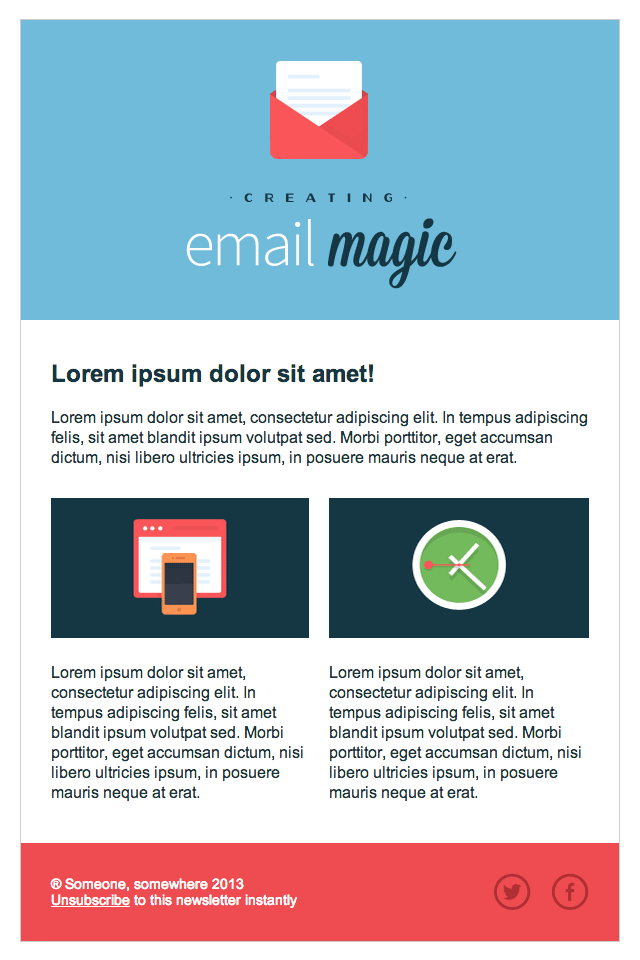

# Xây dựng một template HTML Email từ đầu



Cách tốt nhất để hiểu rõ một thứ nào đó, chính là tự mình làm lại nó từ đầu. Hôm nay, mình sẽ hướng dẫn các bạn thực hiện điều tương tự như vậy, chúng ta sẽ tự xây dựng một template HTML Email từ đầu.

Nếu bạn muốn tìm kiếm một cái gì đó có sẵn, cũng có rất nhiều trang cung cấp sẵn các mẫu HTML Email chop bạn. Tuy nhiên, chắc chắn là nó không miễn phí. Bạn có thể tham khảo ở [đây](https://elements.envato.com/web-templates/email-templates?_ga=2.32880698.56300719.1507171594-551793807.1507171555)

Hoặc bạn cũng có thể thuê một designer để làm điều đó cho bạn trong vòng 2 ngày. Nhưng tại sao bạn lại không tự làm điều đó thay vì bỏ ra 50$ =]. 

## Chuẩn bị
Đầu tiên, mình đã chuẩn bị sẵn các thứ cần thiết trong thư mục part-2-resources, bạn có thể lấy về ở đó.

Ok, tiếp theo bạn sẽ tạo một file html và bắt đầu với XHTML doctype như đã đề cập ở bài [trước]()

```
<!DOCTYPE html PUBLIC "-//W3C//DTD XHTML 1.0 Transitional//EN" "http://www.w3.org/TR/xhtml1/DTD/xhtml1-transitional.dtd">
<html xmlns="http://www.w3.org/1999/xhtml">
 <head>
  <meta http-equiv="Content-Type" content="text/html; charset=UTF-8" />
  <title>Demystifying Email Design</title>
  <meta name="viewport" content="width=device-width, initial-scale=1.0"/>
</head>
</html>
```

Đầy đủ hết rồi, giờ bắt đầu làm thôi :))

## Tạo phần Body và Main Table

Đầu tiên, ta sẽ tạo phần cấu trúc của email, bắt đầu với tag `<body>`. Chúng ta sẽ set margin và padding cho body tag về 0 để xoá hết tất cả khoảng trắng.
Chúng ta cũng sẽ tạo một table với độ rộng bằng 100%. Thật ra, table này đóng vai trò như body tag trong email của chúng ta. Tuy nhiên do việc styling cho body tag không được hổ trợ, do đó chúng ta phải style trên table này =]. Ví dụ như bạn muốn thêm background color vào phần body của email, thay vì chỉnh trên body tag, bạn phải thêm background-color trên table.

Tiếp theo, ta sẽ set cellpadding và cellspacing của các ô table (cell) về 0 hết, để xoá hết các khoảng trắng.

**Chú ý:** Chúng ta sẽ để thuộc tính `border="1"` cho tất cả các table, nhờ vậy, ta có thể quan sát được cấu trúc của layout và dễ dàng tuỳ chỉnh hơn. Sau khi làm xong hết thì ta sẽ xoá hết các thuộc tính này bằng Find & Replace.
Đây là code HTML cho main table của chúng ta.

```
<body style="margin: 0; padding: 0;">
 <table border="1" cellpadding="0" cellspacing="0" width="100%">
  <tr>
   <td>
    Hello!
   </td>
  </tr>
 </table>
</body>
```


> Nếu các thuộc tính có sẵn trên HTML thì chúng ta nên sử dụng chúng thay vì sử dụng CSS

OK, bây giờ chúng ta sẽ đặt một cái table khác lồng vào cái table mới tạo phía trên. Chúng ta sẽ canh giữa cho table này và set độ rộng cho nó là 600 pixels. 600 pixels là một độ rộng an toàn cho email của bạn để có thể hiển thị tốt nhất trên hầu hết độ phân giải ở các desktop cũng như webmail clients.

Nếu bạn để ý, mình luôn style cho các element sử dụng HTML thay vì CSS (width, border, align). Nguyên tắc vàng trong việc viết một HTML email là: "Nếu các thuộc tính có sẵn trên HTML thì chúng ta nên sử dụng chúng thay vì sử dụng CSS".

Chúng ta sẽ thay cái chữ "Hello!" nhỏ nhỏ ở cái main table đầu tiên với đoạn code sau:
```
<table align="center" border="1" cellpadding="0" cellspacing="0" width="600" style="border-collapse: collapse;">
 <tr>
  <td>
   Hello!
  </td>
 </tr>
</table>
```
Chúng ta cũng thêm vào thuộc tính inline style như "border-collapse: collapse;". Chúng ta cần làm vậy vì nếu không, các phiên bản mới hơn của Outlook sẽ thêm vào một khoảng trống nhỏ giữa bảng và border của chúng ta.


## Tạo sườn và Header

Như design ở đầu, ta thấy email được chia làm ba phần (Header, Content, Footer), do đó, ta sẽ tạo mỗi phần tương ứng với một hàng (row).

Chúng ta sẽ copy paste cái row của cái bảng vừa nãy mới làm thành ba phần. Mình đã thêm vào các chữ ở mỗi row để các bạn dễ phân biệt

```
<table align="center" border="1" cellpadding="0" cellspacing="0" width="600">
 <tr>
  <td>
   Row 1
  </td>
 </tr>
 <tr>
  <td>
   Row 2
  </td>
 </tr>
 <tr>
  <td>
   Row 3
  </td>
 </tr>
</table>
```


Bây giờ, ta sẽ thêm màu sắc vào các row như design. Ta sẽ sử dụng thuộc tính `bgcolor` có sẵn của HTML để thêm màu thay vì sử dụng CSS. Thêm một lưu ý là bạn phải luôn sử dụng đầy đủ 6 kí tự của mã màu hex, nó có thể không hoạt động nếu chúng ta rút gọn thành 3 kí tự.

```
<table align="center" border="1" cellpadding="0" cellspacing="0" width="600">
 <tr>
  <td bgcolor="#70bbd9">
   Row 1
  </td>
 </tr>
 <tr>
  <td bgcolor="#ffffff">
   Row 2
  </td>
 </tr>
 <tr>
  <td bgcolor="#ee4c50">
   Row 3
  </td>
 </tr>
</table>
```


OK, tiếp theo ta sẽ tập trung vào row 1. Chúng ta sẽ tuỳ chỉnh padding của cell đó đồng thời thêm hình vào.

### Sử dụng Padding

Khi sử dụng padding trong email, bạn phải luôn khai báo đầy đủ tất cả các giá trị (top, right, bottom, left) nếu không có thể sẽ bị lỗi. Chúng ta có thể sử dụng cách shorthand, ví dụ: `padding: 10px 10px 8px 5px;`, tuy nhiên, nếu gặp vấn đề gì đó bạn nên viết lại dưới dạng longform, ví dụ: `padding-top: 10px; padding-right: 10px; padding-bottom: 8px; padding-left: 5px;`.

Nếu bạn vẫn gặp vấn đề về padding thì ... đừng sử dụng nó nữa =]. Bạn chỉ cần sử dụng các cell trống để tạo các khoảng trống. Bạn cũng không cần sử dụng các "spacer GIF" để tạo khoảng trắng =], chỉ cần chắc chắn là bạn thêm style sau vào cell `style="line-height: 0; font-size: 0;"`, đặt `&nbsp`(Non-breaking Space) vào giữa 2 tag, và khai báo height hoặc width cho nó. Ví dụ:

`<tr><td style="font-size: 0; line-height: 0;" height="10">&nbsp;</td></tr>`


Bạn cũng cần chú ý rằng, sẽ an toàn hơn khi sử dụng padding cho TD tag thay vì tag p hay là div.

Chúng ta đã sử dụng inline CSS để thêm padding vào cell. Tiếp theo, chúng ta sẽ bắt đầu thêm hình vào bằng tag ``, đồng thời bạn nên sử dụng thuộc tính alt và thêm vào `style="display:block;"`. Những thứ này sẽ giúp ngăn các email client thêm các khoảng trống bên dưới hình của bạn. Tiếp tục, chúng ta sẽ canh giữa hình bằng thuộc tính `align="center"`. Việc thêm thuộc tính alt cũng khá quan trọng, khi mail của chúng ta đang được load thì nếu image chưa load xong nó sẽ hiện alt text, giúp cho người đọc biết rằng chỗ đó sẽ có một bức hình.

**Chú ý:** Nếu phần nội dung trong header có vai trò quan trọng trong cần truyền tải đến người đọc thì chúng ta không nên chỉ bỏ hình vào phần header. Bạn nên nhớ rằng các email client thường block hình ảnh, cho nên nếu có một nội dung nào đó quan trọng thì đừng nên bỏ nó vào hinh ảnh. Tuy nhiên ở ví dụ sau thì mình chỉ sử dụng hình ảnh cho header (Phần header của mình cũng không có gì quan trọng lắm =]).
```
<td align="center" bgcolor="#70bbd9" style="padding: 40px 0 30px 0;">
 
</td>
```


## Tạo phần Content
Đầu tiên, chúng ta sẽ thêm vào một chút padding ở cell giữa để tạo khoảng trống xung quanh element.


Tiếp theo, ta sẽ thay cái chữ "Row 2" thành một cái table với 3 row. Những row này sẽ chứa nội dung chính của ta - một cho headline, một cho phần chữ giới thiệu còn row cuối ta sẽ chia thành 2 cột.
Chúng ta sẽ set chiều rộng của table thành 100%, ở đây ta không sử dụng pixel vì sử dụng % sẽ giúp tạo một email responsive dễ hơn. Nếu bạn sử dụng pixel cho width với mọi element, nó sẽ buộc bạn phải thay đổi các giá trị này một cách liên tục, còn khi sử dụng % để set width cho table con, thì khi bạn muốn điều chỉnh width cho các element cha, các table con lúc này cũng sẽ được tùy chỉnh lại một cách tự động.

```
<td bgcolor="#ffffff" style="padding: 40px 30px 40px 30px;">
 <table border="1" cellpadding="0" cellspacing="0" width="100%">
  <tr>
   <td>
    Row 1
   </td>
  </tr>
  <tr>
   <td>
    Row 2
   </td>
  </tr>
  <tr>
   <td>
    Row 3
   </td>
  </tr>
 </table>
</td>
```


OK, bây giờ ta sẽ thêm nội dung vào, đồng thời thêm một chút padding vào cell giữa.


```
<table border="1" cellpadding="0" cellspacing="0" width="100%">
 <tr>
  <td>
   Lorem ipsum dolor sit amet!
  </td>
 </tr>
 <tr>
  <td style="padding: 20px 0 30px 0;">
   Lorem ipsum dolor sit amet, consectetur adipiscing elit. In tempus adipiscing felis, sit amet blandit ipsum volutpat sed. Morbi porttitor, eget accumsan dictum, nisi libero ultricies ipsum, in posuere mauris neque at erat.
  </td>
 </tr>
 <tr>
  <td>
   Row 3
  </td>
 </tr>
</table>
```

Giờ chúng ta sẽ chia row 3 thành 2 cột. Mình muốn 2 cột này sẽ cách nhau một khoảng. Bình thường ta sẽ sử dụng margin, tuy nhiên trong HTML Email thì margin không được hỗ trợ. Vì vậy chúng ta sẽ tạo thêm một cột trống ở giữa 2 cột biên.

Nãy mình nói là chúng ta nên sử dụng % để set width, nhưng mà bây giờ nội dung của ta sẽ có size cố định, do đó nếu chúng ta để % thì có lẽ hơi khó. Ở đây, 2 bức hình của ta có width là 260px, chúng ta sẽ set 2 cột tương ứng với width cũng là 260px, còn cột trống ở giữa chúng ta sẽ để width là 20px. Hãy chắc chắn rằng bạn set font-size = 0, line-height = 0 cho cell giữa, đồng thời chèn vào nó kí hiệu non-breaking space `&nbsp;`.

Chúng ta cũng sẽ set thuộc tính `valign` với giá trị `"top"` cho cả 2 cell ở biên, để giúp content ở hai cell này luôn nằm ở phía trên cùng. Giá trị mặc định của thuộc tính này là `"middle"`.

```
<table border="1" cellpadding="0" cellspacing="0" width="100%">
 <tr>
  <td width="260" valign="top">
   Column 1
  </td>
  <td style="font-size: 0; line-height: 0;" width="20">
   &nbsp;
  </td>
  <td width="260" valign="top">
   Column 2
  </td>
 </tr>
</table>
```


Bây giờ, chúng ta sẽ thêm hình và chữ vào các cột. Ta sẽ phân nội dung thành hai row. Row 1 sẽ chứa hình và row 2 sẽ chứa chữ. Chúng ta sẽ tiếp tục chèn tiếp một bảng khác vào các cột, vì ta không thể sử dụng các tag colspan hay rowspan. Đồng thời ta cũng sẽ thêm một chút padding vào giữa để ngăn tách hình và chữ.

```
<table border="1" cellpadding="0" cellspacing="0" width="100%">
 <tr>
  <td width="260" valign="top">
   <table border="1" cellpadding="0" cellspacing="0" width="100%">
    <tr>
     <td>
      
     </td>
    </tr>
    <tr>
     <td style="padding: 25px 0 0 0;">
      Lorem ipsum dolor sit amet, consectetur adipiscing elit. In tempus adipiscing felis, sit amet blandit ipsum volutpat sed. Morbi porttitor, eget accumsan dictum, nisi libero ultricies ipsum, in posuere mauris neque at erat.
     </td>
    </tr>
   </table>
  </td>
  <td style="font-size: 0; line-height: 0;" width="20">
   &nbsp;
  </td>
  <td width="260" valign="top">
   <table border="1" cellpadding="0" cellspacing="0" width="100%">
    <tr>
     <td>
      
     </td>
    </tr>
    <tr>
     <td style="padding: 25px 0 0 0;">
      Lorem ipsum dolor sit amet, consectetur adipiscing elit. In tempus adipiscing felis, sit amet blandit ipsum volutpat sed. Morbi porttitor, eget accumsan dictum, nisi libero ultricies ipsum, in posuere mauris neque at erat.
     </td>
    </tr>
   </table>
  </td>
 </tr>
</table>
```

Ở đây, ta set width của hình = 100% so với width của cột tương ứng (260px), sử dụng HTML. Sử dụng phần trăm trong thuộc tính width sẽ giúp template của ta responsive hơn, sau này chúng ta chỉ cần sử dụng media queries để thay đổi width của parent element thì các element con sẽ thay đổi theo. Tuy nhiên với height ta phải override nó bằng pixel vì style="height: auto" không hoạt động. Nên chúng ta sẽ set nó bằng pixel. 


## Phần Footer

Phù! Cuối cùng cũng đến row cuối =]. Đầu tiên, chúng ta sẽ thêm phần padding vào footer row (row cuối)

```
<td bgcolor="#ee4c50" style="padding: 30px 30px 30px 30px;">
 Row 3
</td>
```


Trong ô đó, ta sẽ chèn thêm một cái bảng có 2 cột.

```
<table border="1" cellpadding="0" cellspacing="0" width="100%">
 <tr>
  <td>
   Column 1
  </td>
  <td>
   Column 2
  </td>
 </tr>
</table>
```

Chúng ta sẽ tạo một cái table nhỏ chèn vào cột bên phải. Bảng này là nơi chứa cái social media icon của chúng ta. Chúng ta sẽ set thuộc tính `align="right"` cho container td chứa bảng này. Đồng thời, bạn phải set `border="0"` cho những image link (để tránh biến các border thành màu xanh) và đừng quên sử dụng `display:block`.

```
<td align="right">
 <table border="0" cellpadding="0" cellspacing="0">
  <tr>
   <td>
    <a href="http://www.twitter.com/">
     
    </a>
   </td>
   <td style="font-size: 0; line-height: 0;" width="20">&nbsp;</td>
   <td>
    <a href="http://www.twitter.com/">
     
    </a>
   </td>
  </tr>
 </table>
</td>
```


Bây giờ ta sẽ thêm chữ vào cột bên trái. Để cho an toàn, ta sẽ thêm thuộc tính width với giá trị 75%. Còn cột bên phải sẽ có `width="25%"`.

```
<td width="75%">
 &reg; Someone, somewhere 2013<br/>
 Unsubscribe to this newsletter instantly
</td>
```

Vậy là layout của chúng ta đã hoàn thành =].

## Validation

Ta sẽ chạy template này bằng [W3C Validator](http://validator.w3.org/) để chắc chắn không có lỗi gì.
Nếu bạn làm theo một cách chính xác những gì mình đã chỉ, tất cả sẽ đều pass =].


Tiếp theo chúng ta sẽ chạy test bằng Litmus để đảm bảo cấu trúc email hoạt động trơn tru trên mọi email client.


## Ok, bây giờ làm đẹp cho Text một chút nào :D

Dòng đầu tiên là heading. Chúng ta sẽ sử dụng tag `<b>` để tô đậm chữ. Nếu bạn còn nhớ thì chúng ta sẽ luôn chỉnh style = HTML nếu nó có tag đó, thay vì sử dụng CSS.

```
<td style="color: #153643; font-family: Arial, sans-serif; font-size: 24px;">
 <b>Lorem ipsum dolor sit amet!</b>
</td>
```

Chúng ta sẽ tiếp tục thêm inline style sau vào các ô khác của phần content. Cứ thấy containter nào có chữ là thêm vào thôi =]
```
style="color: #153643; font-family: Arial, sans-serif; font-size: 16px; line-height: 20px;"
```


Tiếp theo, ta sẽ style các chữ của footer. Chúng ta sẽ chỉnh link "unsubcribe" bằng cả CSS và HTML tag `<font>`. Sử dụng đồng thời cả hai cách sẽ giúp ta đảm bảo link này không bao giờ hiển thị dưới dạng màu xanh chết chóc (màu xấu vãi chưởng).

```
<td style="color: #ffffff; font-family: Arial, sans-serif; font-size: 14px;">
 &reg; Someone, somewhere 2013<br/>
 <a href="#" style="color: #ffffff;"><font color="#ffffff">Unsubscribe</font></a> to this newsletter instantly
</td>
```


Ok, nhìn cũng đầy đủ rồi á. Chúng ta sẽ xóa hết các border và cùng ngắm nhìn vẻ đẹp của nó =]. Tìm tất cả các thuộc tính `border="1"` và thay bằng `border="0"`


Bây giờ nhìn nó có vẻ hơi trống trống =], có lẽ nên thêm viền lại cho nó. OK, hãy quay lại cái table 600px wide đầu tiên của chúng ta và thêm vào:

```
style="border: 1px solid #cccccc;"
```

bây giờ, trong nó không còn lạc trôi nữa =]. Bước cuối cùng, mình sẽ thêm vào 30px padding ở bottom của tag `<td>` đầu tiên trong main table để tránh cho email của ta bị cảm giác dừng đột ngột trong các mail client như Apple Mail, và 20px padding top cũng của row đó, giúp tạo một chút khoảng trống cho header của chúng ta.

```
<td style="padding: 20px 0 30px 0;">
```


Ok, và test lại lần cuối nào!


Nhìn cũng khá ổn.

## Xong rồi á!

Mà trước khi gửi mail bạn nên kiểm tra lại coi có comment vào code không. Nếu có thì xóa hết chúng đi. Một vài email client có thể bị ảnh hưởng. Tốt nhất là không nên bỏ những g ì không cần thiết vào file code của bạn.

OK, bây giờ kiểm tra thêm lần cuối cùng và HTML email của bạn đã sẵn sàng ^^!

Nếu trong quá trình thực hiện, bạn gặp lỗi hay thắc mắc gì đó có thể hỏi mình bằng cách thêm issue.
[Đây](https://github.com/phucledien/HTMLEmailTemplate) là source hoàn chỉnh sau khi thực hiện xong


